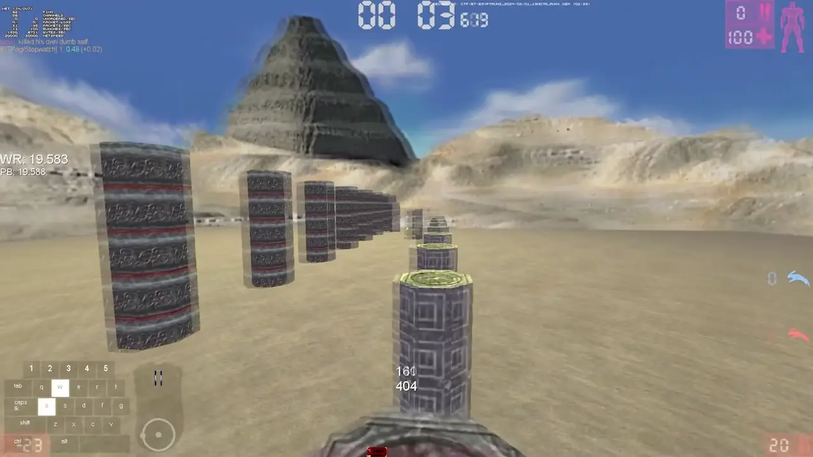

# Demistifying UT99 Dodging
With the release of the UTBT.net world record database, there has been a lot of innovation and discovery in the UT99 speedrunning community. Players are constantly looking for ways to further optimize world records and outcompete each other, which eventually lead to players using excessively expensive peripherals to achieve input times that cannot be achieved on regular hardware.

This created an unfair environment in the community, where players are forced to spend hundreds of euros on hardware in order to compete. While this might seem like a simple solution (just buy good hardware), it quickly becomes unsustainable, as it's only a matter of time until the next mega-super gaming mouse or keyboard is going to come out and offer even better input times. Not to mention players who don't have disposable income to spend on a game that's nearly 25 years old being completely out of competition.

This put the moderation team of UTBT.net in a difficult spot, as there is no good solution that would please everyone. Topics surrounding this led to a lot of heated discussions, with one of the players claiming they can achieve minimal input times on any hardware. They also included video evidence of how it was done. If this is true, that means any player with any hardware can compete with any world record.

## The Weird Dodging of _gøku_

The following is the video evidence in question:


At first, after seeing this video, I was very skeptical. It seems that _gøku_ simply walks in the opposite direction before dodging. Why would this be any faster than regular dodging? But after trying this for a while on one of the UTBT.net servers, I quickly realized that not only does it yield faster input times, but it's as fast as you want it to be. Also, all players have been doing this by accident for years without knowing about it, since all it takes is walking in the opposite direction at certain times, which happen on a variety of maps.

## What is dodging, and how does it work?
Dodging is a mechanic that allows you to traverse the map quicker. When performing a dodge, your character jumps 160 units into the air and gains 1.5 times the current acceleration.


The general consensus for the past 25 years has been that in order to dodge, you need to press twice in the direction you desire to dodge. For regular WASD inputs, this would mean:
- WW = Forward Dodge
- SS = Backward Dodge
- AA = Left Dodge
- DD = Right Dodge

The following is how regular left dodge looks:


If this is how the game actually works, there would be no reason why the _gøku_ method of dodging would yield faster inputs. The only theory I had was that maybe the game doesn't actually check your inputs but rather checks your velocity, which is why I questioned community veteran _niko_ about it, to which he replied:
```Yeah, there are many possibilities, tbh, but without looking at the source, you can only theorize```

Which is exactly what led me to read the source code and to discover this:

```c
Check for Dodge moves.
// flag transitions
bEdgeForward = (bWasForward ^^ (aBaseY > 0));
bEdgeBack = (bWasBack ^^ (aBaseY < 0));
bEdgeLeft = (bWasLeft ^^ (aStrafe > 0));
bEdgeRight = (bWasRight ^^ (aStrafe < 0));
bWasForward = (aBaseY > 0);
bWasBack = (aBaseY < 0);
bWasLeft = (aStrafe > 0);
bWasRight = (aStrafe < 0);
```
And later on:
```c
if (bEdgeForward && bWasForward)
DodgeDir = DODGE_Forward;
if (bEdgeBack && bWasBack)
DodgeDir = Dodge_Back;
if (bEdgeLeft && bWasLeft)
DodgeDir = DODGE_Left;
if (bEdgeRight && bWasRight)
DodgeDir = DODGE_Right;
```


**The GAME doesn't check your INPUTS. It only checks if your VELOCITY in a certain direction is above zero twice in order to initiate a DODGE.**

This is most likely due to the fact that the fact that UT, back in 1999, execessively tried to support all sorts of devices, controllers, and joysticks. If dodge was determined by clicking, then it would mean someone on a controller wouldn't have access to one of the fundamental moves of the game.

This was further confirmed by my unsuccessful attempts to achieve the same result in the next iterations of UT, which do not support controllers.

## What does this mean?
If this code does what it says, it means that in order to dodge, you simply need to:
- Go in the direction you want to dodge.
- Stop
- Go in the direction you want to dodge.

Here is a video of me performing a forward dodge by simply stopping myself (notice how W input is never released):


This can be further optimized by simply holding W and quickly pressing and releasing S.


Performing dodges this way means that dodge click interval is determined not by how fast you click a button twice, but by how fast you release opposite direction button. This means dodge times are as quick as you want them to be. In this example it yielded incredibly quick dodge interval of 23ms on an non-gaming 125Hz keyboard which before was only achievable with high end hardware.

If we further investigate video of _gøku_ performing fast dodges, we can observe exact same thing happening. Dodge gets initiated way before he presses D the second time. There is absolutely no reason for _gøku_ to press D twice as he is already in the air from the first D input:


## Conclusion
These fast dodges can and do happen to everyone in any scenario where the player has to walk in the opposite direction before a dodge. That's probably a big reason why we see players have a small percentage of indredibly fast dodges in almost every record, while the majority of their dodges are around 100 ms. This mechanic is also the culprit of so many instances of feeling that you just randomly dodged off the edge even though you didn't press anything twice (its not you, its UT!).

With this knowledge, every world record is approachable on any hardware. I hope this gives hope and a course of action to old-school players who do not have access to cutting-edge peripherals.
